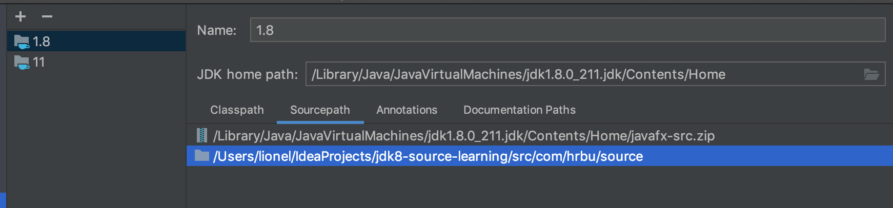
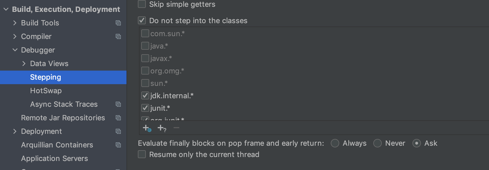

# jdk-source-code-learning

JDK源码学习,Mac系统

## 版本说明

- JDK8

```shell
git checkout mac_1.8.0_211
```

```shell
java -version
```
java version "1.8.0_211"  
Java(TM) SE Runtime Environment (build 1.8.0_211-b12)  
Java HotSpot(TM) 64-Bit Server VM (build 25.211-b12, mixed mode)  

[JDK8 Release Notes](https://www.oracle.com/java/technologies/javase/8u-relnotes.html)

[Java SE 8 Archive Downloads (JDK 8u211 and later)
](https://www.oracle.com/java/technologies/javase/javase8u211-later-archive-downloads.html)

百度网盘[jdk-8u211-macosx-x64.dmg](https://pan.baidu.com/s/1_S7QtLSi_rLu3dIhJuqxhg?pwd=jabm)

## 准备工作

1. 将/Library/Java/JavaVirtualMachines/jdk1.8.0_211.jdk/Contents/Home目录下的src.zip拷贝出来并解压缩。
2. 将解压缩出来的文件拷贝到项目中source包下
3. 修改项目源码路径



## 项目配置

1. 修改编译堆内存


2. 修改断点调试配置



## 目录结构

- image  
  README中的图片
  
- java  
  java文件，普通目录中的，启用项目的时候不会编译这个文件下的文件，用于学习JavaCompiler
  
- source  
  JDK8的源码，解压src.zip，将里面的所有文件放到这个目录下，普通目录不会进行编译
  
- src  
  学习JDK8源码的测试代码，Sources目录下，会进行编译的


